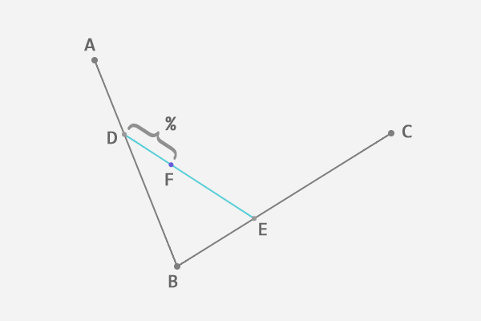
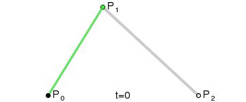
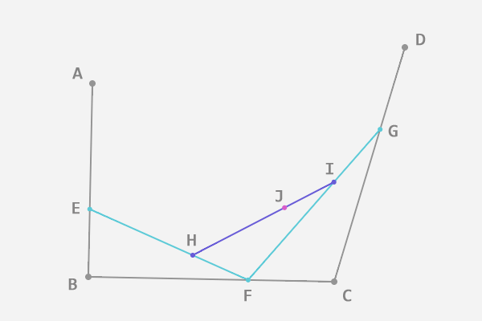
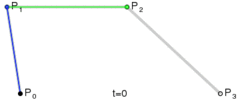
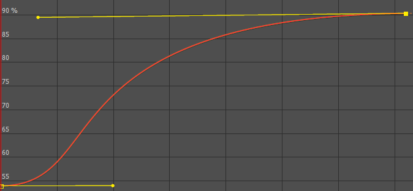
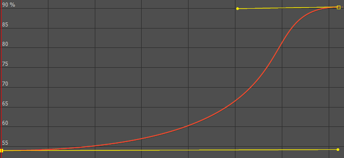
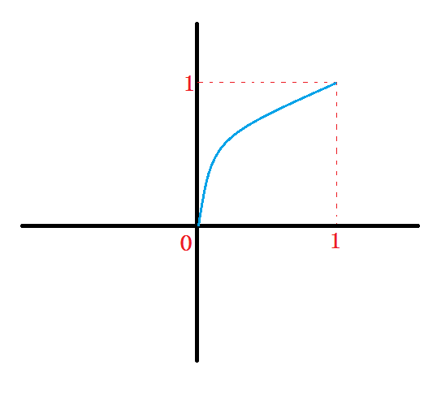
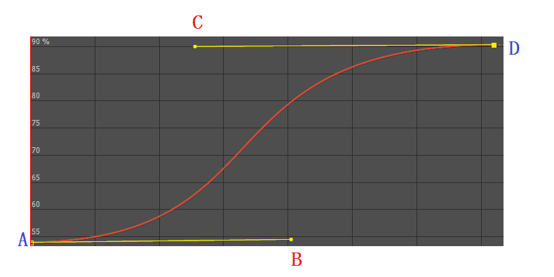

# PathInterpolator简介

> 非原创 转载请:<yujunqing@meizu.com>

----

> api-21引入的新的插值器

> 本文转自：sdk组 张鑫 <http://redmine.meizu.com/documents/268> 

> 同时稍有修改

> 可以直接跳转至结论：[点击跳转](#jump)


## 前言

我们以往的动画开发模式是，交互设计师在AE（Adobe After Effects）或者PS(Adobe PhotoShop)中通过调节曲线来确定最终动画效果，并将所需要的参数导出到EXCEL表格中，开发者获取表格后还需对里面的数据做进一步处理才能转换成对应的插值器并应用到动画当中，而android 手机上的界面刷新受很多因素的影响，比较容易出现掉帧的情况，这样最终做出的动画效果跟交互的要求会有出入，很难达到一致。

而Android 5.0给我们提供了一个全新的插值器PathInterpolator，该插值封装了自定义的Pah以及二阶或者三阶贝塞尔曲线的支持，刚好交互设计师使用的AE或者PS工具中也是通过贝塞尔曲线来实现的，只是他们的操作方式跟我们通过数学模拟的方式不同，所以这中间需要一种转换，下面就详细介绍下：

文章主要分两个部分介绍：

1. 贝塞尔曲线介绍

2. PathInterpolator的介绍以及如何使用
   
### 贝塞尔曲线

首先需要了解的是什么是贝塞尔曲线以及为什么需要贝塞尔曲线。

贝塞尔曲线是一种数学曲线，广泛应用于各种计算机图形处理软件中。网上对贝塞尔曲线的介绍非常多，文章最后也列举了几个关于贝塞尔曲线的链接，在这里就简单说明下原理。

给定几个特定的点，然后由点连成线，保持一定的比例让点运动，这样就形成了一个运动轨迹。例如下图





开始给定三个点A，B，C，然后在AB和BC上找到两个点D和E，满足AD:AB = BE:BC，然后连接DE，在上面找到F点，使得  DF:DE = AD:AB = BE:BC，保持这个比例不变，模拟D点从A往B走，这样F点的轨迹就成了一条曲线，这即是二阶的贝塞尔曲线。同理，给定四个点A，B，C，D，根据同样的规律找出其它的E，F，G，H，I，J点，满足AE:AB = BF:BC = CG:CD = EH:EF = FI:FG = HJ:HI，然后模拟E点从A到B，最终J点的运动轨迹就是一个三阶的贝塞尔曲线






其实对于不同阶的贝塞尔曲线，都有相应的数学公式，只要输入几个控制点的坐标，就可以根据公式模拟出贝塞尔曲线，具体可以参考[维基百科上关于贝塞尔曲线的介绍](http://zh.wikipedia.org/wiki/%E8%B2%9D%E8%8C%B2%E6%9B%B2%E7%B7%9A)，另外给大家提供一个很实用的网站<http://myst729.github.io/bezier-curve/>，在这个上面可以任意指定点（最多七个），然后它就会自动模拟出相应阶数的贝塞尔曲线，方便大家更好的了解绘制过程。

那为啥贝塞尔曲线应用这么广泛呢，尤其是在计算机图形学中应用很多，简单来说是因为在电脑上绘制曲线不能像人手那么灵活，可以直接任意绘制出想要的曲线，所以在计算机中通过对点的控制以及贝塞尔曲线公式来模拟出想要的曲线。

在交互设计师使用的AE或者PS中用来调节动画变化的曲线实际上也是模拟的贝塞尔曲线，大致形状如下：


从图可以看出模拟的是三阶贝塞尔曲线，横轴表示时间，纵轴表示对应的属性变化值。我已经将对应的点标注出来了，可以对照下前面介绍的三阶贝塞尔曲线。一般A和D点是固定的，只要通过改变B和C点在整个坐标系中的位置来调整整个曲线的形状，下面给出了两组任意调整B和C后的曲线。



           

大家如果想体验下这种曲线调节，不需要专门下载AE或者PS，可以直接打开<http://cubic-bezier.com/#0,0,1,1>这个网站，它默认在一个正方形区域中模拟三阶的贝塞尔曲线，起点和终点已经定好了，可以任意调节红色的点和绿色的点，甚至还提供了根据这个曲线来模拟物体的运动轨迹。

 
   

### PathInterpolator

通过上面的介绍已经大致明白了交互设计师是如何调节动画曲线的，那么如何方便的将交互设计师调节出来的曲线参数给到开发工程师，让工程师很方便的创建出对应的插值器呢，这个工作就需要Android 5.0 提供的PathInterpolator类来实现了。

PathInterpolator是一种时间插值器，用途和以往的插值器例如LinearInterpolator，AccelerateDecelerateInterpolator一样，都是用来设置给animator或者animation的，用于调节动画变化的，也是通过setInterpolator()函数来设置给动画的，所不同的是，PathInterpolator需要一段起点是（0,0），终点是（1,1）的path路径，如下图所示:

 

曲线是什么样子，最终的动画变化趋势就是什么样子，如上图，刚开始动画变化幅度很大，到后面变化速度就会变慢下来。

PathInterpolator的几种构造函数如下：

* public PathInterpolator(Path path) 

  支持自定义的Path，但是一定要保证起点是（0,0），终点是（1,1）。

* public PathInterpolator(float controlX, float controlY) 

  构造一个二阶的贝塞尔曲线，就是上图1所示的曲线，其中A点坐标是(0,0),C点坐标是（1,1），这个已经在内部定义好无需再指定，参数controlX和controlY就相当于B点的坐标。

* public PathInterpolator(float controlX1, float controlY1, float controlX2, float controlY2)

  构造一个三阶的贝塞尔曲线，就是上图2所示的曲线，其中A点坐标是(0,0),D点坐标是（1,1），这个已经在内部定义好无需再指定。参数controlX1和controlY1就相当于B点的坐标，参数controlX2和controlY2就相当于C点的坐标。

* public PathInterpolator(Context context, AttributeSet attrs) 

  这个构造函数主要用在以xml方式定义的PathInterpolator，一般不会直接在代码中创建。例如下面的三种方式分别对应上面说的三种曲线。

````
<pathInterpolator xmlns:android="http://schemas.android.com/apk/res/android"
    android:pathData="L0.5,0 C 0.7,0 0.6,1 1, 1" />
    
<pathInterpolator xmlns:android="http://schemas.android.com/apk/res/android"
    android:controlX1="0.4"
    android:controlY1="0"/>
    
<pathInterpolator xmlns:android="http://schemas.android.com/apk/res/android"
    android:controlX1="0.4"
    android:controlY1="0"
    android:controlX2="1"
    android:controlY2="1"/>
````

<span id="jump"/>

### 如何将交互给的动画转化为PathInterpolator

从第一个章节了解到，交互设计师用来调节动画的曲线主要是三阶的贝塞尔曲线，跟交互设计师沟通后了解到，通常对于动画曲线，他们只会去调节B和C点的横向位置，也就是会保持AB和CD是水平的，并且他们可以很容易在工具中读取到B和C点所代表的百分比，刚好PathInterpolator也是在单位正方形中表示的，我们就可以直接根据交互设计师给的比例来创建对应的PathInterpolator。

 

例如当前B的百分比是33%，C的百分比是72%，那对应到单位正方形中以A作为原点，B点坐标就是(0.33,0)，C点坐标是(0.28,1)，所以可以创建PathInterpolator = new PathInterpolator（0.33, 0, 0.28,1）。这样就可以很方便的把交互给的参数转换成开发可以使用的插值器，不用再像以前那样需要一堆的数据然后进行转化，下面提供了一个apk，可以任意设置两个控制点坐标，然后就可以看到利用这几个点创建出的PathInterpolator ，应用在view的放大，平移，透明度以及旋转动画效果，最后面还模拟出了对应的贝塞尔曲线。

 

demo支持设置二阶和三阶的贝塞尔曲线，通过布局中的switch控件来控制，设置好点后，就可以点击button来启动动画，最下面同时在单位正方形中模拟了贝塞尔曲线的样式，详细的可以下载附件中的demo来体验:[AndroidLDemo.apk](res/AndroidLDemo.apk)